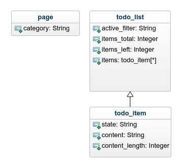

# ceddl with react

This is a Implementation example of ceddl-polyfill with react. It demonstrates how you could use templating and ceddl data model to create a web frontend datalayer.

Files that were changed to add a datalayer to the app:

* package.json
* src/js/app.tsx
* src/js/todoitem.tsx
* src/js/about.tsx
* src/index.html
* src/assets/data-models.ts

Data model that was implemented.


```js
declare var ceddl:any;
class CeddlDataModels {

  constructor(){
    ceddl.modelFactory.create({
        key: 'page',
        root: true,
        fields: {
            category: {
                type: ceddl.modelFactory.fields.StringField,
                required: true,
                choices: 'homepage|about'
            }
        }
    });

    ceddl.modelFactory.create({
        key: 'todoItem',
        root: false,
        fields: {
            state: {
                type: ceddl.modelFactory.fields.StringField,
                required: true,
                choices: 'active|completed'
            },
            content: {
                type: ceddl.modelFactory.fields.StringField,
                required: true,
            },
            contentLength: {
                type: ceddl.modelFactory.fields.NumberField,
                required: true,
            }
        }
    });

    ceddl.modelFactory.create({
        key: 'todoList',
        root: true,
        fields: {
            itemsTotal: {
                type: ceddl.modelFactory.fields.NumberField,
                required: true,
            },
            itemsLeft: {
                type: ceddl.modelFactory.fields.NumberField,
                required: true,
            },
            items: {
                type: ceddl.modelFactory.fields.ListField, // Note the ListField type here
                foreignModel: 'todoItem', // Reference to the key of the sub model
                required: false,
            },
            activeFilter: {
                type: ceddl.modelFactory.fields.StringField,
                required: true,
                choices: 'all|active|completed'
            }
        }
    });

    // Initialize not here but part of the app router.

  }

}

export { CeddlDataModels };
```

## Router code
```js
  declare var Router;
  public componentDidMount() {
    var setState = this.setState;
    var router = Router({
      '/': setState.bind(this, {nowShowing: ALL_TODOS, pageRouteChange: true}),
      '/all': setState.bind(this, {nowShowing: ALL_TODOS, pageRouteChange: false}),
      '/active': setState.bind(this, {nowShowing: ACTIVE_TODOS, pageRouteChange: false}),
      '/completed': setState.bind(this, {nowShowing: COMPLETED_TODOS, pageRouteChange: false}),
      '/about': setState.bind(this, {nowShowing: ABOUT_TODOS, pageRouteChange: true})
    });
    router.init('/');
  }

  // Clean datalayer in re-initialize on page change.
  public componentDidUpdate(prevProps, prevState) {
    if(this.state.pageRouteChange) {
      this.state.pageRouteChange = false;
      ceddl.initialize();
    }
  }
```

## Demo server.
Run `npm install`, `npm run build` and `npm run start` for a dev server. Navigate to `http://localhost:4200/`.

## Licence
ceddl-with-react is [MIT licensed]()

## CEDDL-polyfill
Customer experience digital data layer polyfill. Bridging the gap between the ceddl spec's and the browsers.
For more information please visit [https://www.ceddlbyexample.com/](https://www.ceddlbyexample.com/)
